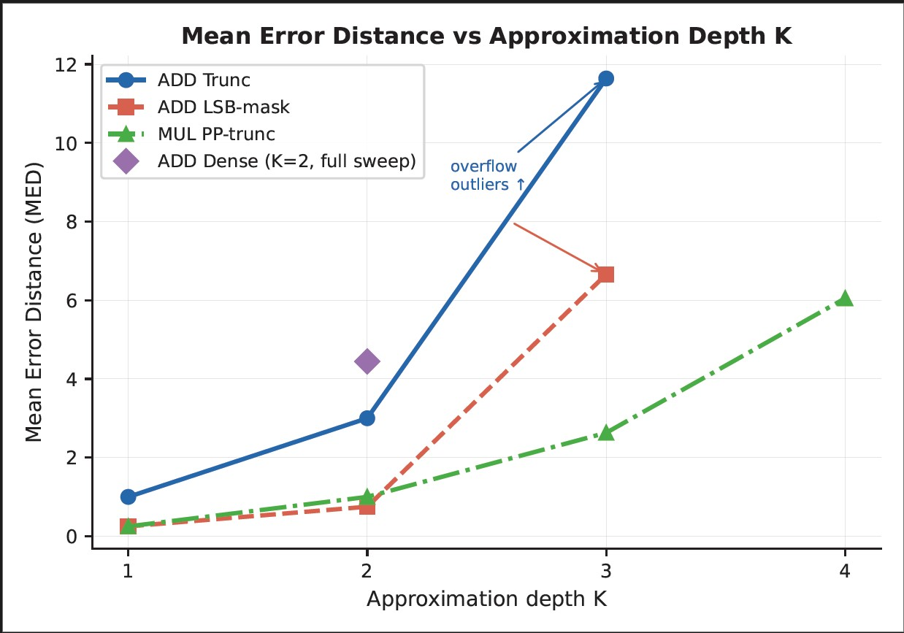
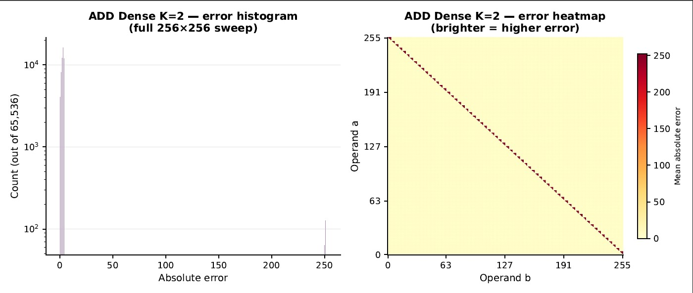
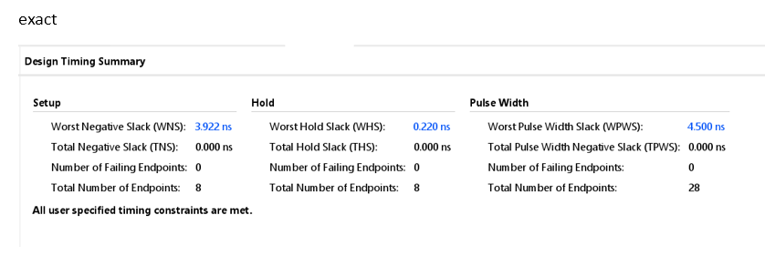
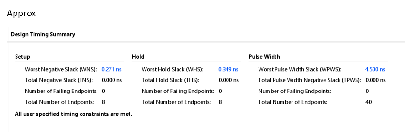

# FPGA-Based Approximate ALU with Design Space Exploration
An FPGA-based implementation of an approximate ALU demonstrating non-trivial trade-offs between accuracy, hardware efficiency, and timing — showing that approximation does not always improve performance.

## Overview
This project presents the design, implementation, and analysis of an **8-bit Approximate Arithmetic Logic Unit (ALU)** using Verilog, targeting a Xilinx FPGA (xc7z020).

The goal is to explore **approximate computing techniques** and evaluate their impact on:
- Accuracy
- Hardware utilization
- Timing performance

Unlike conventional designs, this project performs a **full design-space exploration** across multiple approximation schemes and depths.

---

## Features

-  Exact ALU (baseline)
-  Approximate ALU with multiple techniques:
  - ADD Truncation (AT)
  - ADD LSB Masking (AL)
  - MUL Partial Product Truncation (MP)
  - Dense Approximation (full sweep)
-  Parameterized approximation depth (**K = 1 to 4**)
-  Automated testbench with statistical analysis
-  CSV logging for all experiments
-  Full 65,536 input validation (256 × 256 sweep)
-  FPGA synthesis with timing and utilization analysis

---

## Architecture

### Exact ALU Operations
- ADD
- SUB
- AND
- OR
- XOR
- MUL

### Approximate Techniques

| Technique | Description |
|----------|------------|
| ADD Truncation | Removes lower bits to simplify carry propagation |
| ADD LSB Masking | Masks LSBs to reduce switching activity |
| MUL PP Truncation | Truncates partial products in multiplication |
| ADD Dense | Exhaustive approximation across full input space |

---

## Methodology

### Testbench Features
- Multi-phase evaluation:
  1. Exact baseline
  2. ADD Trunc
  3. ADD LSB Mask
  4. MUL PP Trunc
  5. Dense full sweep
- Metrics computed:
  - Mean Error Distance (MED)
  - Error Rate (%)
  - Maximum Error
- Automated logging to CSV

---

## Evaluation Metrics

| Metric | Description |
|------|-------------|
| MED | Average absolute difference between exact and approximate output |
| Error Rate | Percentage of incorrect outputs |
| Max Error | Maximum deviation observed |
| WNS | Worst Negative Slack (timing margin) |
| WHS | Worst Hold Slack |
| LUT Usage | FPGA resource consumption |
| Carry Chains | Hardware mapping efficiency |

---

## Results & Analysis

### 🔷 Hardware & Accuracy Comparison

| Metric | Exact ALU | Approx ALU | Insight |
|------|----------|-----------|--------|
| Functionality | Fully accurate | Controlled inaccuracy | Trade accuracy for efficiency |
| WNS (Setup Slack) | 3.922 ns | 0.271 ns | Approx design is timing-critical |
| WHS (Hold Slack) | 0.220 ns | 0.349 ns | Both safe |
| Timing Violations | 0 | 0 | Both meet constraints |
| LUT Usage | Baseline | 514 | Slight overhead due to control logic |
| Flip-Flops | Baseline | 39 | Minimal sequential logic |
| DSP Usage | 0 | 0 | Multiplier implemented using LUTs |
| Carry Chains (CARRY4) | Used | 56 instances | Efficient FPGA mapping |
| Error Rate | 0% | Up to ~90% | Depends on K |
| MED | 0 | Increases with K | Non-linear growth |
| Max Error | 0 | High (overflow cases) | Critical edge cases |
| Validation | Limited | 65,536 inputs | Exhaustive |
| Error Distribution | N/A | Structured | Non-random behavior |


The following plots summarize the impact of approximation techniques on accuracy and hardware behavior across different approximation depths (K).
### 🔹 Overall Error Analysis (Combined)

<p align="center">
  
</p>

---

### 🔹 Mean Error Distance vs Approximation Depth

<p align="center">
  
</p>

---

### 🔹 Error Distribution (Heatmap & Histogram)

<p align="center">
  
</p>
Error distribution is structured rather than random, showing strong dependence on operand combinations.


## Timing Analysis

<p align="center">
  
  
</p>

<p align="center">
  <b>Left:</b> Exact ALU &nbsp;&nbsp;&nbsp;&nbsp;
  <b>Right:</b> Approximate ALU
</p>
Despite simplifying arithmetic operations, the approximate ALU exhibits reduced timing slack compared to the exact design. This indicates that additional control logic (masking, truncation) introduces overhead and can disrupt optimized carry-chain paths in FPGA implementations.


## Resource Utilization

- 📄 [Exact Utilization Report](results/reports/exact_utilization.txt)  
- 📄 [Approx Utilization Report](results/reports/approx_utilization.txt)

---

## Key Takeaways
The following key observations are derived from the experimental results and FPGA implementation analysis.

### 1. Approximation ≠ Faster
Despite simplification, the approximate ALU shows:
- Lower timing slack (0.27 ns vs 3.9 ns)

**Reason:**
- Additional control logic (muxes, masking)
- Disruption of optimized carry chains

---

### 2. Non-Linear Accuracy Degradation
- MED increases rapidly with approximation depth (K)
- Error rate grows significantly

**Conclusion:**
Small approximation → manageable error  
Large approximation → rapid degradation

---

### 3. Critical Edge Cases
- Overflow-induced outliers observed at higher K

**Impact:**
- Important for safety-critical systems
- Limits applicability in precise computing

---

### 4. Error is Structured (Not Random)
From histogram and heatmap analysis:
- Errors depend on operand combinations
- Clear patterns observed across input space

**Implication:**
- Predictable approximation behavior → exploitable in design

---

## FPGA Implementation

- **Device:** Xilinx Zynq-7000 (xc7z020)
- **Tool:** Vivado 2025.1

### Resource Utilization (Approx ALU)
- LUTs: 514 (~0.97%)
- Flip-Flops: 39
- DSPs: 0
- BRAM: 0
- CARRY4: 56
- BUFG: 1

### Timing Summary
| Metric | Value |
|------|------|
| WNS | 0.271 ns |
| WHS | 0.349 ns |
| Timing Violations | 0 |

---

## Project Structure

```bash
Approximate-ALU/
│
├── rtl/
│   ├── exact_ALU.v
│   ├── approx_ALU.v
│   ├── top_module.v
│   └── wrappers/
│       ├── exact_wrapper.v
│       └── approx_wrapper.v
│
├── testbench/
│   └── ALU_testbench.v
│
├── constraints/
│   └── Constraints.xdc
│
├── results/
│   ├── csv/
│   │   └── exact_vs_approx.csv
│   │
│   ├── plots/
│   │   ├── combined_analysis.jpg
│   │   ├── error_distribution.jpg
│   │   └── med_vs_k.jpg
│   │
│   ├── reports/
│   │   ├── timing_exact.png
│   │   ├── timing_approx.png
│   │   └── exact_utilization.txt
│   │   └── approx_utilization.txt
│
└── README.md
```
---

## How to Run

### Simulation
1. Open Vivado / simulator
2. Run `ALU_testbench`
3. Generate CSV output

### Synthesis
1. Add constraint file
2. Run synthesis
3. Check:
   - Timing report
   - Utilization report

---

## Applications

- Low-power DSP systems
- AI/ML accelerators
- Image and signal processing
- Error-tolerant computing systems

---

## Conclusion

This project demonstrates that:
- Approximate computing introduces **complex trade-offs**
- Accuracy, timing, and hardware efficiency are **not linearly related**
- Approximation does not always improve performance

---

## Future Work

The current implementation is a design-space exploration harness rather than an optimised approximate ALU. Both exact and approximate units operate concurrently, and all approximation sub-units remain active regardless of the selected mode. This introduces evaluation overhead that inflates power and resource metrics. A production approximate ALU would instantiate only the selected approximation unit, yielding results more representative of true approximate computing trade-offs.


Future work includes a single-unit implementation for fair FPGA benchmarking and ASIC synthesis to isolate transistor-level gains.

---

## Author

Aditya Dwivedi  
Electronics Engineering(VLSI Design and technology)
