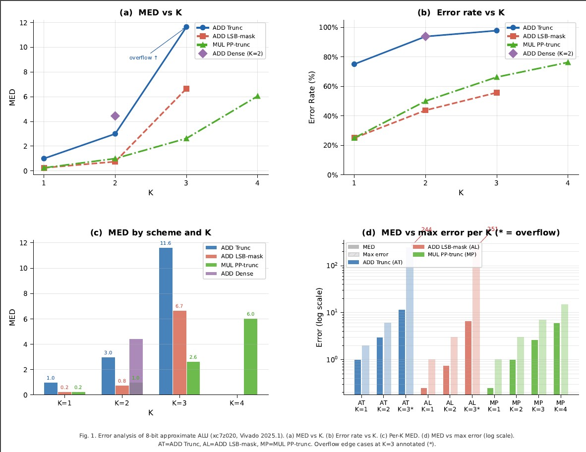
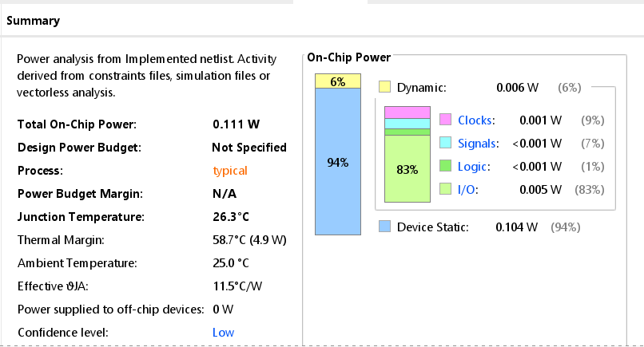
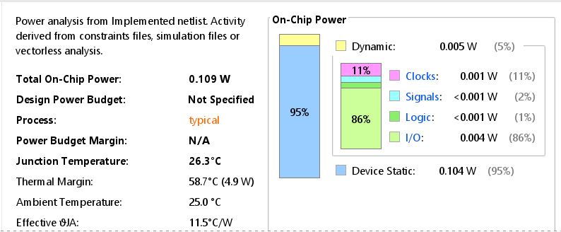

# Approximate ALU: Trade-off Analysis on FPGA

This project explores the impact of approximate computing on hardware design by implementing and analyzing an 8-bit ALU on FPGA.

---

## Project Overview

Approximate computing introduces controlled inaccuracies in arithmetic operations to potentially reduce power, area, or delay. This project evaluates whether such benefits hold true in FPGA implementations.

---

## Repository Structure
```bash

Approximate-ALU/
│
├── configurable/
│   ├── rtl/
│   ├── testbench/
│   ├── constraints/
│   └── results/
│       ├── plots/
│       └── reports/
│
├── isolated_comparison/
│   ├── rtl/
│   │   ├── approx_adder_k2.v
│   │   ├── exact_adder.v
│   │   ├── approx_wrapper.v
│   │   ├── exact_wrapper.v
│   │   └── top.v
│   │
│   ├── testbench/
│   │   └── tb.v
│   │
│   ├── constraints/
│   │   └── constraints.xdc
│   │
│   └── results/
│       ├── power/
│       ├── timing/
│       └── utilization/
│
└── README.md
```
---

# Phase 1: Configurable Approximate ALU

## Design

A parameterized ALU supporting:
- Multiple approximation techniques  
- Variable approximation depth (K)  
- Mode selection via control signals  

### Techniques Used
- ADD Truncation  
- LSB Masking  
- Partial Product Truncation  

---

## Evaluation Metrics

- Mean Error Distance (MED)  
- Error Rate  
- Maximum Error  
- Timing (WNS)  
- Power Consumption  

---

## Results Summary (Phase 1)

| Metric         | Exact ALU  | Approx ALU  |
|----------------|------------|-------------|
| Dynamic Power  | 0.007 W    | 0.012 W     |
| WNS            | 3.922 ns   | 0.271 ns    |
| LUTs           | baseline   | 514         |

---

## Visual Analysis (Phase 1)

### Error Distribution
<p align="center">
  
</p>

### Error vs Approximation Depth
<p align="center">
  
</p>

### Combined Analysis
<p align="center">
  
</p>

---

## Key Observations

- Approximation does not guarantee performance improvement  
- Timing degrades significantly (3.922 ns → 0.271 ns slack)  
- Dynamic power increases (0.007 W → 0.012 W)  
- Error increases non-linearly with approximation depth  
- Control logic (muxing + modes) introduces major overhead  

---

## Insight

Configurable flexibility introduces hardware overhead that can negate the expected benefits of approximation.

---

The observations from the configurable design motivated a controlled experiment to isolate the effect of approximation without control overhead.

---

# Phase 2: Controlled Approximate ALU (Fixed Design)

## Design Approach

To eliminate overhead, a simplified design was implemented:

- Fixed approximation method (K = 2)  
- No multiplexers or control logic  
- Dedicated datapath  

### Implementation

- Lower 2 bits → bitwise OR  
- Upper bits → standard addition without carry propagation  

See `isolated_comparison/rtl/` for full implementation.

---

## Results Comparison (Phase 2)

| Metric | Exact | Approx (K=2) | Change |
|------|------|-------------|--------|
| Total On-Chip Power | 0.111 W | 0.109 W | −1.8% |
| Dynamic Power | 0.006 W | 0.005 W | −17% |
| Signal Power | 7% of dynamic | 2% of dynamic | −71% |
| Slice LUTs | 8 | 8 | No change |
| Slices | 2 | 4 | +2 (routing only) |
| CARRY4 | 2 | 2 | No change |

### Exact Power
<p align="center">
  
</p>

### approx Power
<p align="center">
  
</p>

---

## Observations

- Dynamic power reduced by 17%  
- Signal switching reduced by ~71%  
- LUT usage unchanged due to carry-chain mapping  
- Slice count increases due to routing, not logic  

---

## Key Insight

The 71% reduction in signal switching activity confirms that approximate computing's power benefit is real — but only when control overhead is eliminated. A configurable multi-mode design can negate all gains through mux and mode-select logic alone.

---

## FPGA-Specific Observation

Total power is dominated by static power (~90%), limiting the overall impact of logic-level optimizations.

---

# Final Conclusion

This project demonstrates that approximate computing is not inherently beneficial.

- Configurable designs introduce control overhead that degrades timing and power  
- Fixed designs enable measurable power improvements  
- FPGA architecture (carry chains and routing constraints) strongly influences outcomes  

Approximate computing must therefore be carefully aligned with both hardware architecture and implementation methodology.

---

# Tools Used

- Verilog HDL  
- Xilinx Vivado  

---

# Author

Aditya Dwivedi  
VLSI Design & Technology  
